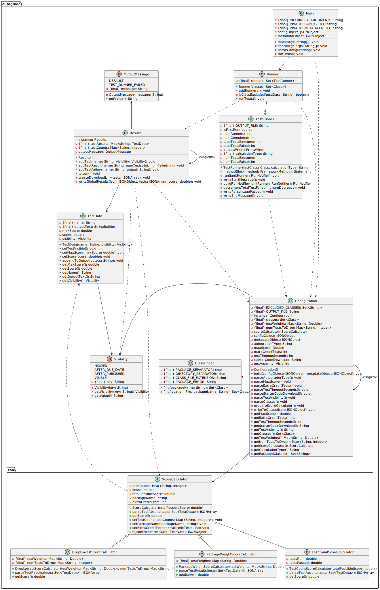

# Gradescope Autograder

## Templates for Java JUnit Tests

This repository contains tools used to create, manage, and process Gradescope Java programming assignments.

Currently used to automate some grading aspects at Rose-Hulman Institute of Technology (CSSE220 - Intro to OOP)

### What This Project Is

- A resource to automate the unit testing process
  - Support for any assignment with a test suite (graphics included!)
- Uniformity for submitting homework assignments and exams
- Near instant scoring and feedback for students

### What This Project *Isn't*

- A replacement for traditional grading processes
  - It is recommended to read and understand code before assigning a grade
- A grading tool for every programming language
  - The `autograded` template only supports Java projects
  - The `manual` template can be modified to check file existence but will not run further tests

### Folder Structure

- `/resources` Documentation for managing assignments in Gradescope
- `/file-tool` CSSE220 standard project builder from student submissions with added functionality for Gradescope exports
- `/builder` Automated tool for creating autograders
- `/templates` The base code required to compile and run the autograder

Check out the [wiki](https://github.com/cm090/gradescope-autograder/wiki) for more information

### `autograded` Template Class Diagram

