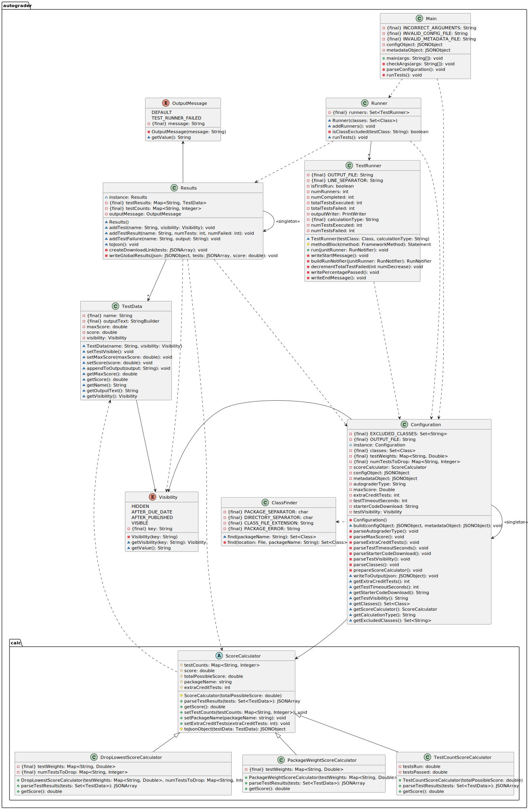

# Gradescope Autograder

This repository contains the tools used to manage Gradescope assignments for CSSE220 at Rose-Hulman Institute of Technology

### Folder Structure

- `/resources` Documentation for managing assignments in Gradescope
- `/file-tool` CSSE220 standard project builder from student submissions with added functionality for Gradescope exports
- `/rename-tool` Rename folders exported from Gradescope without a template
- `/templates` The base code required to compile and run the autograder

See [`/templates/homework/README.md`](https://github.com/cm090/gradescope-autograder/tree/main/templates/homework#readme) for more information

### `autograded` Template Class Diagram

